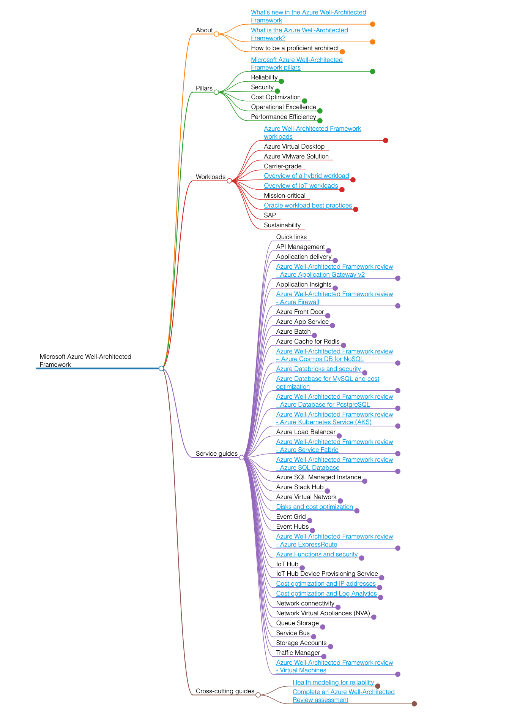

# Azure Well-Architected Framework Mindmap


[](https://github.com/phucnt1992/azure-well-architected-framework-mindmap/actions/workflows/ci.yml)
[](https://github.com/phucnt1992/azure-well-architected-framework-mindmap/actions/workflows/cd.yml)

This is a mindmap generator of the [Azure Well-Architected Framework](https://learn.microsoft.com/en-us/azure/well-architected/).

Published page: 🗺️ [Mind map](https://phucnt1992.github.io/azure-well-architected-framework-mindmap/)



## Requirements

- [Python 3.12](https://www.python.org/downloads/)
- [NodeJS LTS](https://nodejs.org/)
- [Taskfile](https://taskfile.dev/)

## Usage

```bash
# Install dependencies
task init

# Run tests
task test

# Generate the mindmap (in the `output` folder)
# 1. Clone docs from the official repo
task clone-docs
# 2. Markdown format only
task run
# 3. HTML format
task generate

# Clean all workspace
task clean
```

## License


This project is licensed under the [MIT License](LICENSE).
